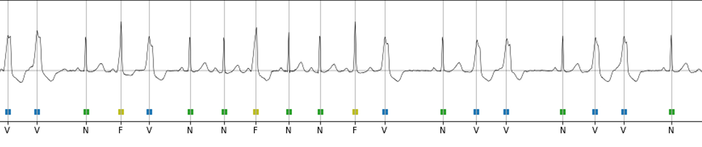

# ECG

* Contains Lead-2 ECG data set : [ECG Lead 2 Dataset PhysioNet (Open Access)](https://www.kaggle.com/datasets/nelsonsharma/ecg-lead-2-dataset-physionet-open-access)
* Contains sample code for working with ECG Data, like:
    * [Pre-Processing](https://github.com/Nelson-iitp/ECG/blob/main/pre-processing/ecg-signal-pre-processing.ipynb)
    * [Data Representation](https://github.com/Nelson-iitp/ECG/blob/main/physionet/starter-ecg-dataset-physionet.ipynb)
    * [Extracting Heart-Beats](https://github.com/Nelson-iitp/ECG/blob/main/physionet/ecg-detailed-view-and-extracting-heart-beats.ipynb)

### Author
[Nelson.S](mailto:nelson.navnel@gmail.com)
